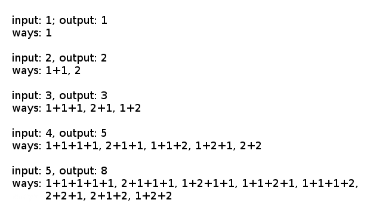

# Binary Gap
## Problem
You are climbing a stair case. It takes `n` steps to reach to the top.

Each time you can either climb 1 or 2 steps. In how many distinct ways can you climb to the top?

Note: Given `n` will be a positive integer.

### Example 1:
```
Input: 2
Output: 2
Explanation: There are two ways to climb to the top.
1. 1 step + 1 step
2. 2 steps
```

### Example 2:
```
Input: 3
Output: 3
Explanation: There are three ways to climb to the top.
1. 1 step + 1 step + 1 step
2. 1 step + 2 steps
3. 2 steps + 1 step
```

## Solution
### JavaScript
```javascript
const climbStairs = function(n) {
  if(n === 1) return 1;
  let fib = [1,2];
  while(fib.length < n) {
    let penultimate = fib[fib.length - 2];
    let ultimate = fib[fib.length - 1];
    fib.push(penultimate + ultimate);
  };
  return fib[fib.length - 1];
};
```

### Ruby
```ruby
def climb_stairs(n)
  return 1 if n == 1
  fib = [1,2]
  fib.push(fib[-2] + fib[-1]) while fib.length < n
  fib.last
end
```

## Explanation (JavaScript)
### Reasoning
I diagrammed this problem out by hand up to an input of `6` and realized that the solutions were forming the Fibonacci Sequence (see diagram below). Once I realized that, solving for an input of `n` simply became solving for the `nth` Fibonacci number.



### Analysis (JavaScript)
Time Complexity: `O(n)`
* Solving for input `n` requires finding the `nth` Fibonacci number, which will require `n` iterations through the accumulating loop. This gives us a time complexity of `O(n)`.

Space Complexity: `O(n)`
* Solving for input `n` requires finding the `nth` Fibonacci number, which will require storing an array `n` Fibonacci numbers long. This gives us a space complexity of `O(n)`.

## Secondary Solution
### JavaScript
```javascript
var climbStairs = function(n) {
  if(n === 1) return 1;
  let fib = [1,2];
  for(let i = 0; i < n - 2; i++) {
    fib[1] = fib[0] + fib[1];
    fib[0] = fib[1] - fib[0];
  };
  return fib[1];
};
```

### Reasoning
In this secondary solution, I've swapped space efficiency for time efficiency. My first solution is storing the entire Fibonacci Sequence up to Fibonacci number `n`. This creates a space complexity of `O(n)`. My second solution does not do this. It only ever stores the final two Fibonacci numbers (these being the necessary two to continue the sequence). This solution is not slower in complexity (both are `O(n)`), but it is slower in actual time, as it utilizes more array lookups and mathematical operations to get around not storing the entire Fibonacci Sequence. My second solution's space complexity is `O(1)`.
